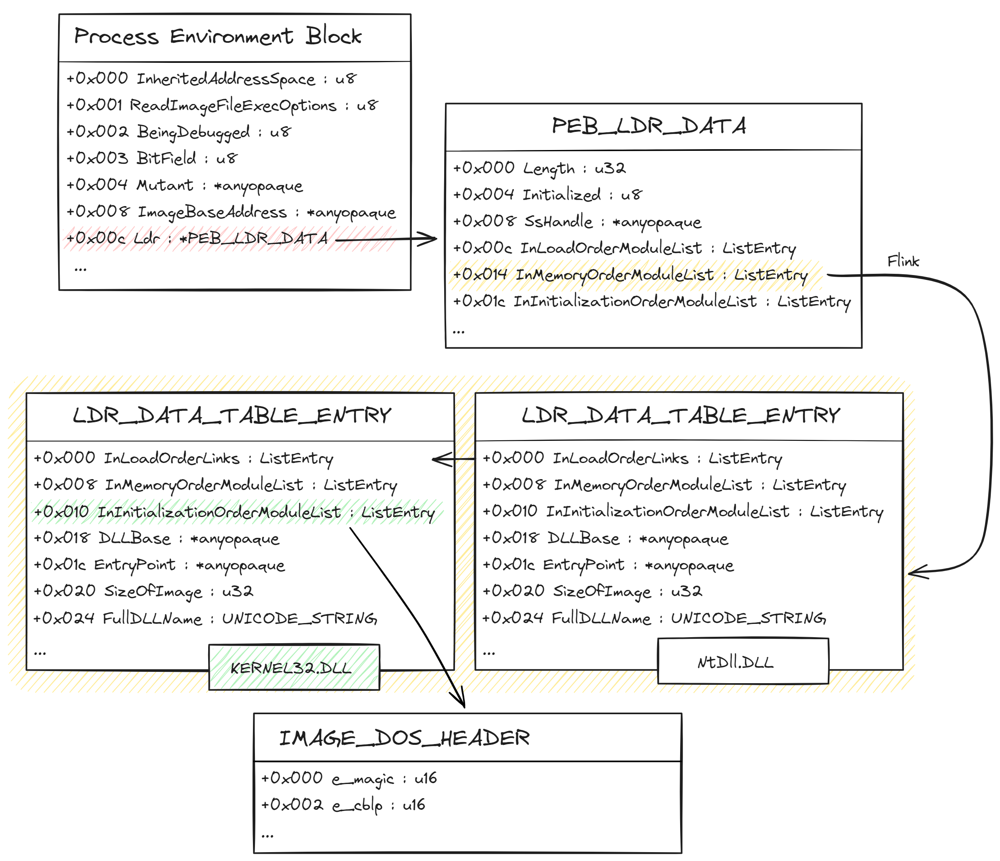
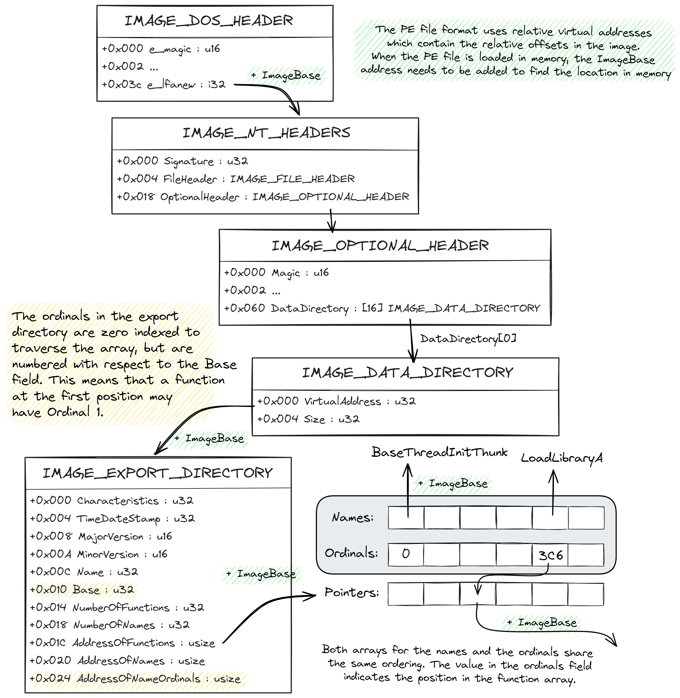
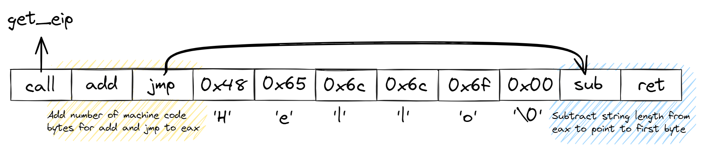

# Exploring Zig for writing shellcode

This project started around Christmas and New Year's Eve to learn a new programming language: Zig. A simple *hello world* program is usually the first hurdle to familiarize yourself with a new language, but doesn't cover many of the language core features. Since Zig is considered a systems programming language and aims to replace C, I decided to adapt the *hello world* example by implementing it as shellcode – and explore how well this new language is suited for this type of task. Broadly speaking, shellcodes are small and very carefully hand-crafted pieces of machine-code instructions used in the field of binary exploitation to demonstrate software vulnerabilities, such as buffer overflows or other flaws where user input is not handled properly. Shellcode is characterized by the fact that it is self-contained and has no dependencies on other components of a binary, such as references to the data segment, or direct API calls for interacting with the operating system. Similar to a parasite, shellcode lives in a host (process) and can perform its functions autonomously while staying under the radar.

When compiling source code in a general-purpose programming language like C or C++, the compilation process does not enforce the strict rules on its output that are required for shellcode. For example, when building the program, the compiler will distribute the individual parts to code and data segments. If this output would be used as shellcode inside a foreign process, it would most likely lead to runtime errors and fail due to invalid addresses generated by the compiler. Therefore, shellcode is most commonly implemented in assembly language directly to have a finer control of the machine code. However, there are attempts to implement shellcode in general-purpose languages like C. This usually requires to only use a specific subset of the features to avoid that the compiler will add unwanted instructions during the build process. One example are static strings, which are stored in the initialized data segment. Another practice is to implement certain functionality of the shellcode in general-purpose language and let the compiler output assembly files which are then combined with hand-crafted assembly parts. The article [From a C project, to assembly, to shellcode](https://github.com/vxunderground/VXUG-Papers/blob/main/From%20a%20C%20project%20through%20assembly%20to%20shellcode.pdf) by hasherezade provides a beginner-friendly and intuitive introduction into this topic. 

When familiarizing myself with the Zig programming language I noticed that there are several features and design decisions which could make the language quite interesting to write shellcode. In particular, Zig's comptime feature allows to run specific code-regions at compile time. In combination with its inline assembly expressions it provides novel ways to design hand-crafted but easy to use components (such as simple functions) that do lead to compiled source code that complies with the strict rules for shellcode.

This repository presents a proof-of-concept to use Zig on the Windows operating system to execute a message box, but implemented in a way that its code can be injected into another process and run its functionality from there. Here, the focus is on techniques and details that prevents the Zig compiler from generating machine code that references addresses outside the code segment. In order to achieve this, inline assembly cannot be completely avoided. Nevertheless, the language offers ways to concentrate such expressions quite locally and to organize them into parts similar to templates or blueprints to support the compiler in complying with the strict rules when generating the output.


## Repository Content

The proof-of-concept code for invoking a message box can be found in *implant.zig* while some recreated win32 structures are refactored into *implant_structs.zig*. *loader.zig* contains the code for running the shellcode from *implant.zig* in a separate thread. Here, it extracts the payload bytes of the compiled *implant.zig* shellcode and copies them into a memory location in its own address space. This proof-of-concept targets 32-bit platforms. Both programs can be compiled with the following commands. 

```bash
zig build-exe implant.zig -O ReleaseSmall
zig build-exe loader.zig -O ReleaseSmall
```

When building *implant.zig* the compiler will add a couple of opcodes to terminate the process gracefully when executing the shellcode in its own process. This is done by calling ExitProcess, and likewise adding one entry in the import address table. As far as I know there is currently no way around it but removing these bytes manually.

The remaining parts of this README will provide some context and background information on how to perform function address resolution and how to handle initialized data, before summarizing specific concepts on how to overcome those problems when compiling shellcode written in Zig.

## Compiling towards position independent code

The layout of a compiled program consists of a set of segments, such as the code segment holding executable instructions and segments of initialized or uninitialized data or other type of resources. When we instruct Windows to run an executable the windows loader will parse the Portable Executable (PE) file to map its image into the virtual address space of a newly spawned process. This applies both to the code segments and data segments. Additionally, the windows loader will load all the necessary shared libraries into the address space (e.g. kernel32.dll) to have all external functions imported that the program relies on during its execution. As long as this executable runs within its own process, instructions can reference those functions with the help of the import address table, or by directly accessing the locations in the data segment.

However, when the same code is executed within a different process, the virtual address space has a different memory layout and does not carry the expected address locations anymore. Therefore, the execution will most likely either result in a crash or undefined behavior.

Compiling for position independent code requires to implement techniques that enforce the compiler to not reference any addresses outside of the code segment. In our case, the *hello world* program wants to output a static string, and access a function to instruct the operating system to display this string in the form of a message box. For this, the shellcode needs to look up the corresponding function address at runtime. Similarly, the shellcode needs to store its message somewhere in the code segment. The following sections recapitulate approaches which are widely established in the cybersecurity field on how this can be achieved from a theoretical perspective and then reviews details specific to the Zig programming language that were used for implementing the *hello world* shellcode.


## Retrieving function pointers from shared libraries dynamically

The Process Environment Block ([PEB](https://www.geoffchappell.com/studies/windows/km/ntoskrnl/inc/api/pebteb/peb/index.htm)) is an internal structure within the windows operating system that exists for each user-mode process. This structure is opaque and not [officially documented](https://learn.microsoft.com/en-us/windows/win32/api/winternl/ns-winternl-peb) by Microsoft as its fields are subject to change across Windows versions, and therefore not intended to be used by developers directly. Instead, Windows provides in its API many functions to retrieve specific information from the PEB independent of the version number. For example, one of these functions is IsDebuggerPresent from Kernel32 which simply returns the corresponding value if a debugger is attached to the process.

The PEB contains the lowest-level of information about a user-mode process, including which modules are currently loaded into the virtual address space. To resolve the function pointers of a loaded DLL dynamically, it requires to traverse all loaded modules to find the specific DLL by its name. The overall procedure is visualized in Figure 1: The PEB can be accessed from a constant offset in either the FS or GS register, depending whether being on a 32-bit or 64-bit platform. The Ldr field points to a PEB_LDR_DATA structure responsible to keep track of all loaded modules. By iterating through the list of LDR_DATA_TABLE_ENTRY structures starting from one of the three list headers and examining its DLLName field, a specific module can be found by its DLL name. The corresponding imagebase address is stored in the InInitializationOrder field.



Once the module has been located, the next step is to find the export directory in the PE file format. Figure 2 shows an overview of which path within the header structures needs to be taken. The export directory contains all symbols that can be imported via dynamic linking and can be accessed from the list of data directories in the optional header. Its structure, namely the IMAGE_EXPORT_DIRECTORY, contains two lists that share the same ordering: One for the function names, and one for the function ordinals. A third list references the list of function pointers. These function pointers can be resolved using the ordinals, which represent the index at which point in the function list a pointer can be found. In order to find the pointer of a specific function by its name, the first step is to iterate over the names array to find the index in that array which stores the same function name. This index can be used to get the ordinal value from the list of ordinals. This ordinal is then being used as an index to get the pointer to the function address.



The *hello world* proof-of-concept shellcode needs two functions for its operation: LoadLibraryA to instruct the operating system to load a module into the address space, and MessageBoxA to display a message box, which is part of User32.dll. Importing the function GetProcAddress is not necessary since the shellcode has its own variant already to acquire the pointer to LoadLibraryA, which can be reused to find the pointer for MessageBoxA. With the above described technique, no process specific addresses are encoded into the machine code. 

Zig's standard library provides various structures from the PE-file format in its standard library. However, not all structures are included and therefore it is necessary to recreate the missing ones, such as the IMAGE_EXPORT_DIRECTORY, using extern structs. Overall, it is fairly straight forward to traverse through these structures in Zig. However, it may require a lot of pointer casting and adjusting the pointer alignment because of Zig’s strong type system and the fact that the PE-file format references some structures via byte offsets. Another method would be to use c-pointer, however, this is not recommended. Accessing the PEB can be done via the corresponding register directly through inline assembly. Here, Zig enforces to set the type of the returned value to comply further usage with its strong type system. This helps detecting errors at compile time. A quite nice feature of Zig’s structures is the possibility to define custom formatting functions, which can be used in the development process to print the structures content (similar to overloading Java’s toString() class methods) and verify its data without having them compiled into the final shellcode. 

It might be tempting to use built-in functions from the standard library, such as std.mem.len when looking and comparing for the right function name. However, some functions including std.mem.len are implemented in a way to support different types and the compiler will add bytes into the data segment causing the shellcode to fail by trying to access the data segment.
  

## Implementing a custom read-only memory in the code segment

One method of making read-only data such as static strings accessible to the shellcode is to store them directly in the code segment, and design those segments in a way that the instruction pointer will never reach them. Zig’s inline assembly supports the usage of directives such as .asciz to define zero-terminated strings at a specific location – including the code segment. This is perfect for strings known at compile time. In order to prevent that the instruction pointer reaches those bytes, it is necessary to model a jump right before the first byte that points after the zero-terminated string to continue with normal execution flow. This jump has to be relative to comply with being position independent. However, this requires knowing the current location of the instruction pointer. There are several techniques that enable localization of the instruction pointer (see this [blog post](https://danielebellavista.blogspot.com/2014/10/ia32-shellcodes-get-eip-value.html)). The proof-of-concept implant employs a technique that utilizes a call instruction to read the address of the return instruction from the stack, which matches the address of the next instruction.  

```zig
noinline fn get_eip() *usize {
    return asm volatile ("mov (%esp), %eax"
        : [ret] "={eax}" (-> *usize),
    );
}
```

By declaring a function as noinline, the compiler will generate a call instruction which places the return address on the top of the stack. This address can be capture within that function using Zig's inline assembly expressions. Marking the inline assembly expression as volatile ensures that the optimizer does not touch the code, but keeps it unchanged due to possible side effects. Furthermore, Zig also allows to annotate the type of the returned value. 

Designing the read-only segments within the code segment requires a combination of inline assembly expressions and comptime features. To the best of my knowledge, there is no way to model them without direct assembly instructions. After the position of the instruction pointer is determined, the length of the string (including the null terminator) and the number of bytes for the opcodes are added to this address, followed by a jump instruction to bypass the string bytes in memory. Finally, the number of bytes must be subtracted again to obtain a pointer pointing to the first byte of the string.



While the implementation, which produces a suitable sequence of machine code for this concept at compile time, consists to a large extent of assembly instructions, these instructions are locally concentrated and do not require any further adjustments outside the function definition. Instead, its return value can be treated like an ordinary slice. The following code snipped illustrates how the function can be used in the main function of the implant shellcode. Since its functionality is performed at compile time, it also allows to obfuscate the string during compile time. Eventually, the generated machine code would only contain the bytes of the encrypted string – without any references into the data segment. 

```zig
pub fn main() void {
    const shift = 3;

    const s1 = place_string_in_cs("Hello World!");
    const s2 = place_string_in_cs(caeser_encrypt("Merry Christmas!", shift));

    var decrypted: [16]u8 = undefined;
    caesar_decrypt(s2, shift, &decrypted);

    std.debug.print("s1: {s}\n", .{s1});
    std.debug.print("s2: {s}\n", .{decrypted});
}
```

## Implementing a storage for strings on the stack

There is another method for storing strings in shellcode: the stack. String characters can be moved one-by-one into the stack memory via a sequence of push operations and become available in the same way as a local variable within the function's scope. However, this requires great attention because all local variables are addressed with respect to the current location of the stack pointer. Additional push operations change the stack pointer and thus make referencing of all local variables unusable. Furthermore, this also affects cleaning up of the stack frame and returning to the caller function.

Zig’s standard library comes with a collection of different memory allocators to make all memory allocations explicit. One of these allocators is a fixed buffer allocator, which takes a pre-allocated segment of memory (for example on the stack) and orchestrates the corresponding allocation requests. I took this allocator as an inspiration to design a strings on stack allocator which orchestrates the push commands within the boundaries of a pre-allocated memory region. During allocation, the stack pointer will be moved so that the push commands will only affect the pre-defined memory region, and restore the original stack pointer location before finishing. While many aspects of this allocator rely on handcrafted inline assembly expressions, its usage is again very simple and a code snippet is provided below:

```zig
pub fn main() void {
    var strings: [100]u8 = undefined;

    var allocator = StringsOnStackAllocator.init(&strings);
    const s1 = allocator.alloc("Hello world!");
    defer allocator.free(s1);

    const s2 = allocator.alloc("Merry Christmas!");
    defer allocator.free(s2);

    std.debug.print("s1: {s}\n", .{s1});
    std.debug.print("s2: {s}\n", .{s2});
}
```

Essentially, the underlying concept works as follows: A push operation works with respect to the native register size, which means that on a 32-bit platform a pair of 4 bytes will be stored on the stack. This means that each string gets constructed with a sequence of push commands that push 4-bytes at a time. If the string length (including the zero-terminator) is not a multiple of the native register size, all remaining bytes will be 0. The strings on stack allocator is implemented in a way that multiple strings can be stored on the stack (considering that the pre-allocated memory is big enough), and even allows freeing them for storing new strings. Also, note that the compiler decides in which order local variables will be stored, and potentially even align them for efficiency reasons.

## Error handling

There are various scenarios in which parts of the shellcode may be prone for failure. These include, for example, the case when the Kernel32 module is not present in the virtual address space, resulting in that the function LoadLibraryA cannot be found. While this case is very unlikely, it can also happen that a module of interest gets unloaded and not being visible temporarily. Another error can occur if the stack memory is too small for storing strings.

Zig allows to combine return types with an error set. If a called function detects that some parts of its functionality does not work properly, it can return the corresponding error value. I was particularly interested if Zig’s error handling functionality works when programming for position independent code or if it would require information stored outside of the code segment. Luckily, since error sets are implemented similar to enums where each entry is a non-zero value it requires no additional information. This can be very useful when developing shellcode. However, once the payload gets injected into another process and fails there, it is difficult to catch the error code while staying in Zig's error system (it may not even be possible at this point). Although error sets are very similar to enums, so far there is no way to control which non-zero value will be assigned. And since the error code has to be transferred through the win32 API (more precisely through the GetExitCodeThread function) this lack of transparency can also lead to problems. Moreover, the corresponding values of the error codes can fall victim to the optimizer of the compiler.

## Extracting the shellcode bytes from the compiled binary
Zig’s compiler will add specific instructions around the generated machine code to allow the process to terminate gracefully. This includes also a call to ExitProcess and a corresponding entry in the Import Address Table (IAT). Wrapping the code of the implant into its own function and calling only this function from main simplifies the extraction of the particular machine code. Here, the stub generated by the compiler is easy to isolate. Furthermore, having the main code in its own function helps in building up a stack frame. Keep in mind that the purpose of the shellcode is to run in some thread, and after finishing its execution the stack frame gets cleaned up. If the implant code would be written directly in the main function, this cleanup procedure can lead into problems as the stack might contain additional data which interferes with the thread context. When this happens, an exception is usually raised, leading to the termination of the host program, and potentially revealing the presence of foreign code.

## Conclusion

Zig offers a set of very handy tools that allow programmers and cybersecurity professionals to write very efficient and readable shellcode. One of these tools is the comptime keyword which executes  certain code regions at compile-time. In combination with inline assembly expressions, Zig enables the construction of templates to model machine code sequences that require a finer control but are specific to a platform. When these templates are implemented, they can be integrated into the main code and abstract the underlying complexity significantly. In particular with storing strings, this repository shows two methods for fairly common techniques of how ascii characters can be embedded into either the code segment or locally on the stack. Furthermore, optional encryption routines allow that the character sequences are obfuscated during compile time and do not appear as readable strings in the binary.

Zig’s compiler outputs machine-code directly, but supports also the generation of an assembly file that corresponds to the compiled binary output. This assembly file can be used to inspect the generated source code and verify that no references to data segments are present. Furthermore, it can also be used for additional optimizations on the instructions or for applying obfuscation techniques, such as in [Covert Computation – Hiding code in code through compile-time obfuscation](https://www.sciencedirect.com/science/article/pii/S0167404814000030) or [Exploiting self-modification mechanism for program protection](https://ieeexplore.ieee.org/document/1245338), to hide its functionality. 

In total, the shellcode of the *hello word* implant has a length of 652 bytes which is still relatively small. The compiler optimization option for ReleaseSmall produces a very compact representation of the machine code which reduces the number of bytes significantly but also disables safety checks.

Overall, the Zig programming language shows very promising capabilities and interesting design decisions for writing robust, reliable and easy to read shellcode. Zig integrates smoothly with the C programming language and allows to import symbols from C directly. The Zig compiler has a built-in C compiler, and promises making integration between Zig and C source codes very smooth. However, one drawback is that the language is still under construction and probably many years away from a stable release. This repository uses and has been tested with the pre-release version 0.12.0-dev. 

